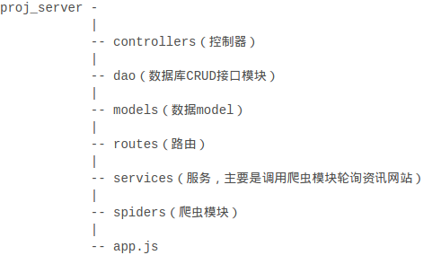

# README

------

## 项目难点及解决方案

我负责的部分是为应用搭建简单的服务器。一开始应用开始设计的时候，考虑的需求是设计一个能够收集资讯的app，资讯的来源是一些大型的资讯新闻网站。那最容易想到的资讯获取方法就是通过爬虫。那从架构上讲，服务器主要的两个职能是，爬取一些资讯网站的资讯数据，并且可以为app前台服务。能完成这些需求的工具和语言选择挺多的，爬虫上可以使用python，js，java等语言来完成，但考虑到我们目前所掌握的能力还有快速开发的需求，我们还是选择使用js。采用node.js + express搭建具有爬虫功能的简单的服务器。从顶层设计上，将服务器功能划分为爬虫和前台服务两个模块。爬虫的话，考虑到资讯来源的更新频率，将爬虫设计成一个定时定量轮询的模块。轮询后所得的数据用数据库进行持久化。前台app使用http请求向服务器获取资讯列表还有详情页，返回的数据考虑使用json对象。而处于便于输出json对象的考虑，后台服务器使用mongodb这一轻量级的数据库作爬虫数据的持久化还有前台程序的数据获取源。

简单地设计之后就开始进行服务器代码的编写。首先我是将爬虫模块先写好。在爬虫数据源的选择上，原先是选择使用腾讯新闻等资讯收集网站，但是在实验的时候就发现，这些网站的反爬虫能力较强，基本无法爬取。后来在队友的提示下，选择对环球网、人民网等资讯产出网站进行爬取，测试结果也表明这些网站比较好获取，而且进行长时间的爬取也不会出现被封IP的情况。所以最后选择使用环球网和人民网作为爬取数据源。利用chrome的network工具，找到了上述网站的网页生成方式：人民网的后台是直接将html生成好发送到前端的；而环球网是使用ajax异步获取资讯列表后，利用前端程序渲染出最终的网页html。所以根据不同网页的生成方式，对人民网采取获取整个网页之后利用网页解析模块cheerio进行内容的解析，再生成资讯json对象插入数据库。而对环球网直接对其ajax链接进行数据获取，将返回的json对象进行必要的转换之后生成所要的新的json对象再插入数据库。这样就完成了爬虫模块的编写。

前台服务模块就较为简单了，主要的路由包含三个：服务器开启状态判断、新资讯列表获取、资讯详情页内容获取。

所以最终的项目架构就是这样，基本上是MVC架构：

## 项目总结

在完成这次project的过程中还是经历了很多东西，包括从前期的架构设计，工具选择；编写后台程序的过程中怎么考虑模块化、尽量分层解耦以降低测试与以后功能扩展的难度等等。技术上面，在完成project的过程中也顺便学到了不少关于http、web、爬虫、代理等等方面的知识。而在和负责前台代码编写的队友合作的过程中页真正体会到了团队合作开发的感觉，比起往常自己一个人写代码多了一些交流于思维碰撞的乐趣。